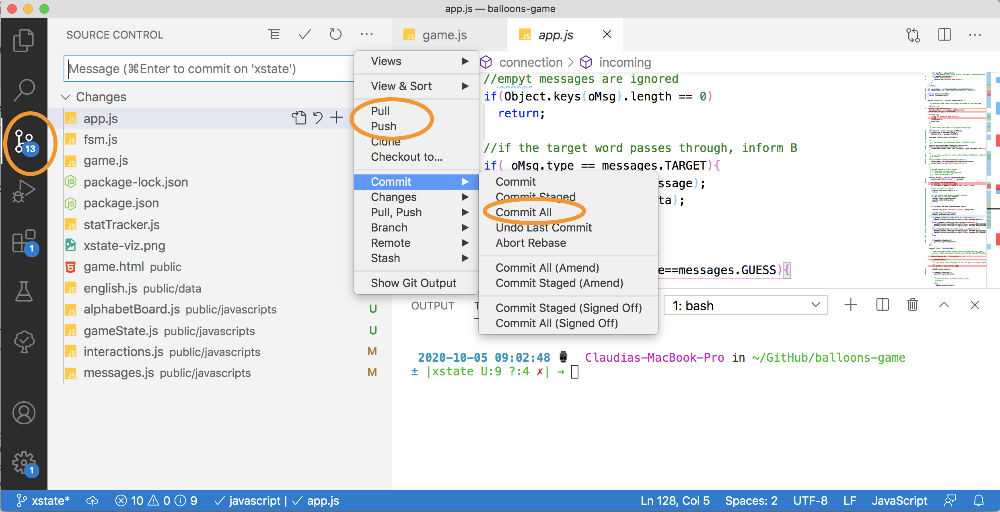
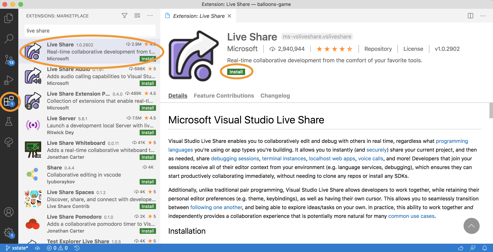

# :bug: How to use VSC <!-- omit in toc -->

The project is conducted in pairs of students. Here we provide an overview of how VSC can help you to work **efficiently** in pairs. You have two options:

- You familiarize yourself with the basics of `git`, a popular version control system to file changes. The source code resides in a public or private code repository hosted on GitHub or another platform. VSC supports `git`. Both team members can code on their local source code copies and merge their code intermittently.
  - Positive: `git` is used by most developers today, it is a a tool/protocol that you will need to learn at some point; later courses in software engineering will cover `git` in more detail. 
  - Negative: if something goes wrong (for example, you are both editing the same functions locally and try to merge) you need to know a few details in order to get back on track or get help from our TAs.
- You use VSC's Live Share functionality: the source code resides on a single machine and both team members can collaboratively work in the same shared code session in real-time. 
  - Positive: easy, no knowledge of source control mechanisms is required. 
  - Negative: the code resides on a local machine, there is by default no backup in the cloud.

## Table of Contents <!-- omit in toc -->
- [Collaborating via Git+GitHub](#collaborating-via-gitgithub)
  - [Git](#git)
  - [GitHub](#github)
  - [Local vs. remote repository](#local-vs-remote-repository)
  - [GitHub and VSC](#github-and-vsc)
- [Live Share](#live-share)
- [Debugging Node.js scripts](#debugging-nodejs-scripts)

## Collaborating via Git+GitHub

### Git

`git` is a version control system created by [Linus Torvalds in 2005](https://www.linuxfoundation.org/blog/2015/04/10-years-of-git-an-interview-with-git-creator-linus-torvalds/), originally intended for the Linux kernel community. It has now become the de-facto standard for distributed version control. It records the changes made to a file or a set of files in a **repository** (a specific storage location). This is particularly useful when several people are working on the same code: you can see who made what changes, revert the changes back to a previous state, compare changes, or decide what to do in case of conflict (e.g. the same piece of code was modified concurrently by different people).

Version control systems can be centralized, with the repository located on single server, or distributed like `git`, where every collaborator has a local copy of the repository with the whole history of changes.

You can download and install git from [here](https://git-scm.com/downloads). Then you can run `git` commands directly from the terminal, or you can use VSC to run the `git` commands on your behalf. The latter is easier.

### GitHub

[GitHub](https://github.com/) is a web-based hosting service for `git` repositories. That way collaborators can push and pull changes to the repository located at GitHub, and synchronize it with their local copies. *Note that GitHub is not the only git repository hosting service; we do not cover any alternatives but they work in a similar fashion to GitHub.*

In order to work with GitHub, all group members must have a [GitHub account](https://github.com)&mdash;if you do not yet have one, create one. One project member will then create a new repository for the project by clicking on *New repository*. It can be public, so everyone can see it, or private, where you control who can see and access it.

Now you can add your partner to the repository, so you can work together. To that end go to the main page of the new repository and click on the *Settings* tab :point_down::

Options available after creating a new repository on GitHub.

A menu will appear on the left which has an entry `Manage access`: click it. A click on `Invite a collaborator` will lead to a popup where you can search for your team member's GitHub account. Add the account as collaborator.

### Local vs. remote repository

The repository created on GitHub is the **remote repository**&mdash;all team members contribute code to this remote repository. Every team member also has a **local repository**, the repository residing on a team member's physical machine. When a team member makes code changes, these are first recorded in the **local repository** and then in a second step recorded in the **remote repository**.

### GitHub and VSC

You can clone the GitHub repository from VSC following [these instructions](https://code.visualstudio.com/docs/editor/versioncontrol#_cloning-a-repository).

_Note: after adding the URL of the remote repository and after indicating the folder where the local repository will be created, you will be asked for the GitHub user name and password._

When you edit your project, the `Source Control` icon :point_down: at the left will indicate the number of files modified. You can record a set of changes in your local repository by clicking on `Commit All`. Remember to add a meaningful message so it can be useful to follow the status of the project. Once your changes are registered in your local repository, you synchronize with the remote repository, so that your changes make it to the shared repository on GitHub. In order to do that, use the `Push` command you find in the same menu as the commit commands. In order to pull the code from the remote repository (where your partner is also pushing to), use the `Pull` command. You can see how to use other git commands [here](https://git-scm.com/docs).

Source control view of VSC.

If you want to give this setup a try, we suggest you start setting things up early and get help from the TAs if you get stuck. All TAs are familiar with `git`, GitHub and VSC!

## Live Share

If you do not yet care about `git`, use the Live Share option instead. For smaller projects (like the one in this class) where you may not need to track changes, you can effectively work together as a team with the VS Live Share extension. Head to VSC's *Extensions* tab, search for *Live Share* and install it (by clicking "install") :point_down::

VSC's *Extensions* tab.

After installing the extension in VSC you will see a *Live Share* icon in the left-hand side menu of VSC. The first time you click on it you will be asked to sign in to VSC with Microsoft or GitHub. After signing in, you will see in your VSC the URL you can share with your team member. Once your team member clicks the link, her local instance of VSC will display the shared project. Host and partners can then edit the files and see any changes made by their partners in real time. You can even debug collaboratively: when the host starts debugging, partners can not only see the debugging window, but they can also use debugging options (step into, step over, add breakpoints, write expressions to evaluate, etc.).

**Bear in mind that only the project owned by the host is actually modified. That also means that once the host closes VSC (or the collaborative session), their partners can no longer collaborate until it is open again. It also means that the non-hosting partner has no access to the code, unless it is shared via another channel.**

## Debugging Node.js scripts

You can enter VSC's debugging window by clicking on the `Run and Debug` icon in the left-hand side menu of VSC. From this window you can run the code in debug mode by clicking on the `Run and Debug` button.

The execution will stop at each breakpoint you have defined. Once the execution stops, you will be able to watch the values of the variables, the values of expressions you define, and the call stack. From here you can continue or execute the next lines of code step by step.

Since JavaScript is [dynamically typed](https://developer.mozilla.org/en-US/docs/Glossary/Dynamic_typing) common programming mistakes can remain unnoticed before running the code. [`@ts-check`](https://code.visualstudio.com/docs/nodejs/working-with-javascript#_type-checking-javascript) is a good tool to catch some of these mistakes at the very moment you write your code.

You can find more information about debugging in VSC [here](https://code.visualstudio.com/docs/editor/debugging).